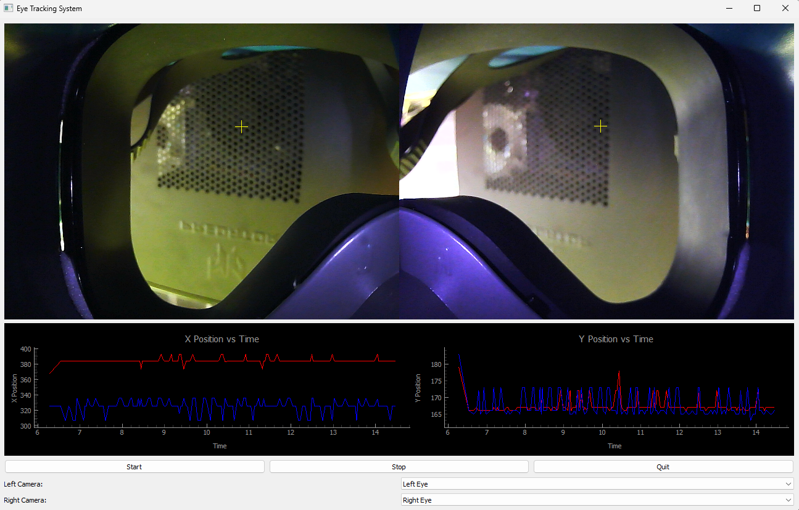
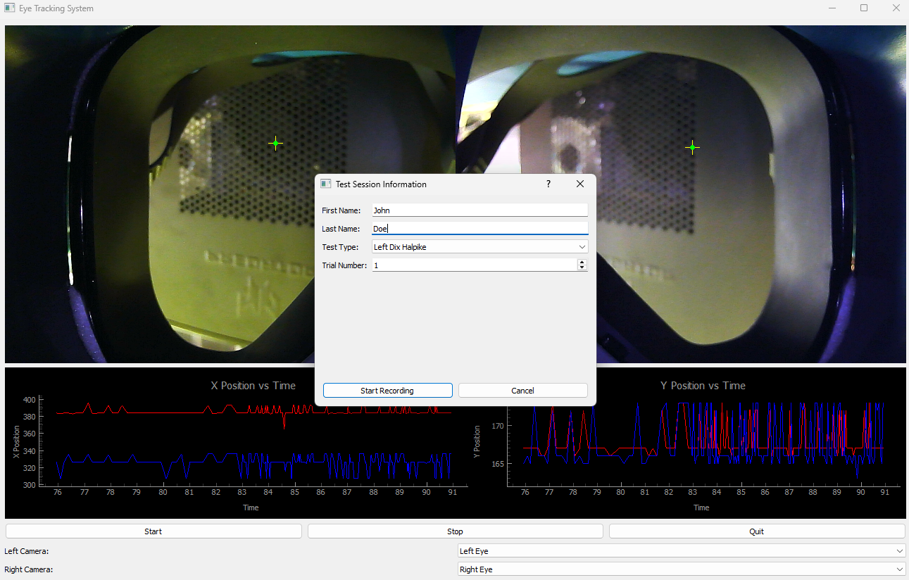

# 👁️ Eye Tracking Software - Complete User Tutorial

## 📋 Table of Contents
1. [Overview](#overview)
2. [Installation & Setup](#installation--setup)
3. [Getting Started](#getting-started)
4. [Camera Configuration](#camera-configuration)
5. [Recording Sessions](#recording-sessions)
6. [File Organization](#file-organization)
7. [Data Analysis](#data-analysis)
8. [Troubleshooting](#troubleshooting)
9. [Advanced Features](#advanced-features)

---

## 📖 Overview

The Eye Tracking Software is a comprehensive tool designed for medical professionals to perform vestibular assessments. It captures real-time eye movements from dual cameras, detects pupil positions, and provides detailed analysis for BPPV (Benign Paroxysmal Positional Vertigo) diagnosis.

### 🎯 Key Features
- **Dual Camera Support**: Simultaneous left and right eye tracking
- **Real-time Processing**: Live pupil detection and movement analysis
- **Professional Recording**: Session management with patient information
- **Data Export**: CSV files with detailed eye movement metrics
- **Video Recording**: MP4 files with synchronized plots and camera feeds
- **BPPV Analysis**: Machine learning-based likelihood assessment

---

## 🛠️ Installation & Setup

### Prerequisites
- Python 3.7 or higher
- Windows 10/11 (tested on Windows 10.0.26100)
- Two USB cameras (for left and right eye tracking)

### Step 1: Install Dependencies
```bash
# Navigate to the project directory
cd Pos-Iris

# Install required packages
pip install -r requirements.txt
```

### Step 2: Camera Setup
1. **Connect Cameras**: Plug in two USB cameras
2. **Camera Positioning**: 
   - Position one camera for left eye tracking
   - Position one camera for right eye tracking
   - Ensure proper lighting and focus

### Step 3: Launch Application
```bash
python src/main.py
```

---

## 🚀 Getting Started

### Initial Launch
When you first launch the application, you'll see:

1. **Main Window**: 1200x800 pixel interface
2. **Camera Feeds**: Two video streams (left and right eyes)
3. **Control Panel**: Camera selection dropdowns and control buttons
4. **Real-time Plots**: X and Y position graphs

### Interface Layout



The main interface consists of:
- **Top Section**: Dual camera feeds showing left and right eye tracking
- **Middle Section**: Real-time plots displaying X and Y position data over time
- **Bottom Section**: Camera selection dropdowns and control buttons

---

## 📷 Camera Configuration

### Camera Selection
The software automatically detects available cameras and allows manual selection:

1. **Auto-Detection**: 
   - Software scans for cameras named "Left Eye" and "Right Eye"
   - Automatically assigns them to appropriate positions

2. **Manual Selection**:
   - Use the dropdown menus to select cameras
   - Left Camera dropdown: Choose camera for left eye
   - Right Camera dropdown: Choose camera for right eye

### Camera Requirements
- **Resolution**: Minimum 640x480 (recommended 1280x720)
- **Frame Rate**: 30 FPS recommended
- **Focus**: Auto-focus or manual focus on eye region
- **Lighting**: Adequate illumination for pupil detection

### Camera Positioning Tips
- **Distance**: 30-50 cm from patient's eyes
- **Angle**: Slightly above eye level for optimal pupil visibility
- **Stability**: Use tripods or mounts to prevent movement
- **Lighting**: Avoid direct light reflection on eyes

---

## 🎬 Recording Sessions

### Starting a Recording

1. **Click "Start" Button**
   - Opens the Test Session Dialog
   - Fill in patient information

2. **Session Information Dialog**



The dialog includes fields for:
- **First Name**: Patient's first name
- **Last Name**: Patient's last name  
- **Test Type**: Dropdown selection for test type
- **Trial Number**: Sequential trial number
- **Action Buttons**: Start Recording and Cancel options

3. **Required Information**:
   - **First Name**: Patient's first name
   - **Last Name**: Patient's last name
   - **Test Type**: Select from available tests:
     - Left Dix Halpike
     - Right Dix Halpike
     - Left BBQ Roll
     - Right BBQ Roll
   - **Trial Number**: Sequential trial number (1, 2, 3...)

4. **Countdown Phase**
   - 3-second countdown appears on screen
   - "Recording starts in: 3, 2, 1..."
   - Recording begins automatically after countdown

### During Recording

**Real-time Features**:
- **Live Detection**: Crosshair markers show detected pupil centers
- **Ellipse Overlay**: Green circles show pupil boundaries
- **Position Tracking**: Real-time X/Y coordinate display
- **Velocity Calculation**: Movement speed in pixels/second
- **Live Plots**: Continuous updating of position graphs

**Visual Indicators**:
- Yellow crosshairs: Detected pupil centers
- Green circles: Pupil boundary ellipses
- Red/Blue lines: X and Y position plots

### Stopping a Recording

1. **Click "Stop" Button**
   - Immediately stops video recording
   - Saves all data files
   - Closes current session

2. **Automatic Cleanup**
   - Video file finalized
   - CSV data saved
   - Metadata updated
   - Session reset for next recording

---

## 📁 File Organization

### Directory Structure
```
Pos-Iris/
├── result_videos/
│   └── [Patient_FirstName]_[Patient_LastName]/
│       └── [TestType]_[TrialNumber]_[Date]/
│           ├── [TestType]_[TrialNumber]_[Date].mp4    # Video recording
│           ├── [TestType]_[TrialNumber]_[Date].csv    # Eye movement data
│           └── [TestType]_[TrialNumber]_[Date].json   # Session metadata
├── src/
│   ├── app.py              # Main application
│   ├── camera_handler.py   # Camera management
│   ├── csv_handler.py      # Data recording
│   ├── plotting.py         # Real-time graphs
│   ├── pupil_detection.py  # Eye detection algorithm
│   └── prediction.py       # BPPV analysis
└── model/
    └── best0811(2).pkl     # Machine learning model
```

### File Types Explained

#### 1. **MP4 Video File** (`[TestType]_[TrialNumber]_[Date].mp4`)
- **Content**: Combined camera feeds + real-time plots
- **Frame Rate**: 20 FPS (optimized for processing overhead)
- **Resolution**: Based on camera input + plot overlay
- **Duration**: Matches recording session length
- **Codec**: MP4V, XVID, or MJPG (automatic fallback)

#### 2. **CSV Data File** (`[TestType]_[TrialNumber]_[Date].csv`)
- **Columns**:
  - `frame_number`: Sequential frame identifier
  - `timestamp`: Time since recording start (seconds)
  - `left_x`, `left_y`: Left eye pupil coordinates
  - `right_x`, `right_y`: Right eye pupil coordinates
  - `left_velocity`, `right_velocity`: Movement speed (px/sec)
  - `left_size`, `right_size`: Pupil diameter (pixels)
- **Sample Rate**: 30 FPS target (actual may vary)
- **Format**: Comma-separated values

#### 3. **JSON Metadata File** (`[TestType]_[TrialNumber]_[Date].json`)
```json
{
  "session_info": {
    "patient_first_name": "John",
    "patient_last_name": "Doe",
    "test_type": "Left Dix Halpike",
    "trial_number": 1,
    "session_date": "20250103",
    "session_time": "14:30:25",
    "datetime": "2025-01-03T14:30:25.123456"
  },
  "folder_structure": {
    "patient_folder": "path/to/John_Doe",
    "test_folder": "path/to/LeftDixHalpike_1_20250103",
    "video_file": "path/to/video.mp4",
    "csv_file": "path/to/data.csv",
    "json_file": "path/to/metadata.json"
  },
  "recording_settings": {
    "target_fps": 30,
    "roi_width": 150,
    "roi_height": 150,
    "max_data_points": 200
  },
  "camera_info": {
    "left_camera": "Left Eye Camera",
    "right_camera": "Right Eye Camera"
  },
  "recording_results": {
    "total_frames_recorded": 450,
    "recording_duration": 15.2,
    "actual_fps": 29.6,
    "recording_completed": true,
    "completion_time": "2025-01-03T14:30:40.123456"
  }
}
```

### Naming Convention
- **Patient Folder**: `[FirstName]_[LastName]`
- **Test Folder**: `[TestType]_[TrialNumber]_[Date]`
- **Files**: `[TestType]_[TrialNumber]_[Date].[extension]`

**Examples**:
```
John_Doe/
├── LeftDixHalpike_1_20250103/
│   ├── LeftDixHalpike_1_20250103.mp4
│   ├── LeftDixHalpike_1_20250103.csv
│   └── LeftDixHalpike_1_20250103.json
└── RightBBQRoll_2_20250103/
    ├── RightBBQRoll_2_20250103.mp4
    ├── RightBBQRoll_2_20250103.csv
    └── RightBBQRoll_2_20250103.json
```

---

## 📊 Data Analysis

### CSV Data Analysis
The CSV files contain comprehensive eye movement data suitable for:

1. **Statistical Analysis**:
   - Mean velocity calculations
   - Movement pattern analysis
   - Saccade detection
   - Nystagmus quantification

2. **Visualization**:
   - Import into Excel, Python, or R
   - Create custom plots and graphs
   - Time-series analysis

### BPPV Analysis
The software includes machine learning-based BPPV likelihood assessment:

1. **Model**: Pre-trained classifier (`best0811(2).pkl`)
2. **Features**: Position, velocity, and pupil size data
3. **Output**: Probability score (0-100%)
4. **Window Size**: 150 frames per analysis segment

### Data Quality Metrics
- **Frame Rate**: Actual vs. target FPS
- **Detection Rate**: Percentage of successful pupil detections
- **Signal Quality**: Based on ellipse fitting confidence
- **Recording Duration**: Total session time

---

## 🔧 Troubleshooting

### Common Issues

#### 1. **Camera Not Detected**
**Symptoms**: No video feed, camera dropdown empty
**Solutions**:
- Check USB connections
- Restart application
- Verify camera drivers
- Try different USB ports

#### 2. **Poor Pupil Detection**
**Symptoms**: Missing crosshairs, inaccurate tracking
**Solutions**:
- Improve lighting conditions
- Adjust camera focus
- Clean camera lenses
- Reposition cameras

#### 3. **Video Recording Issues**
**Symptoms**: Fast playback, missing frames
**Solutions**:
- Check available disk space
- Close other applications
- Verify codec support
- Reduce processing load

#### 4. **Application Crashes**
**Symptoms**: Unexpected shutdown, error messages
**Solutions**:
- Check Python version compatibility
- Verify all dependencies installed
- Review error logs
- Restart computer

### Performance Optimization

#### 1. **System Requirements**
- **CPU**: Multi-core processor recommended
- **RAM**: 8GB minimum, 16GB recommended
- **Storage**: SSD for faster file I/O
- **USB**: USB 3.0 for camera data transfer

#### 2. **Settings Adjustment**
- **ROI Size**: Adjust `roi_width` and `roi_height` (default: 150x150)
- **Frame Rate**: Modify `target_fps` in CSV handler
- **Data Points**: Change `max_data_points` for memory usage

#### 3. **Camera Optimization**
- **Resolution**: Lower resolution for better performance
- **Frame Rate**: Match camera's native frame rate
- **Exposure**: Auto-exposure for consistent lighting

---

## ⚙️ Advanced Features

### Custom Configuration

#### 1. **ROI (Region of Interest) Settings**
```python
# In app.py, modify these values:
self.roi_width = 150   # Width of detection area
self.roi_height = 150  # Height of detection area
```

#### 2. **Frame Rate Control**
```python
# Adjust video recording frame rate:
self.video_fps = 20.0  # Conservative frame rate
```

#### 3. **Data Storage Limits**
```python
# Modify maximum data points in memory:
self.max_data_points = 200  # Increase for longer sessions
```

### Integration Capabilities

#### 1. **External Data Export**
- CSV files compatible with statistical software
- JSON metadata for database integration
- Video files for presentation and review

#### 2. **API Integration**
- Modular design allows custom extensions
- CSV handler can be modified for different formats
- Plot manager supports custom visualizations

#### 3. **Batch Processing**
- Multiple session support
- Automated file organization
- Metadata aggregation

### Security and Privacy

#### 1. **Data Protection**
- Local storage only (no cloud upload)
- Patient data in organized folders
- Secure file naming conventions

#### 2. **Access Control**
- No built-in authentication
- File system permissions apply
- Manual backup recommended

---

## 📞 Support

### Getting Help
1. **Check Logs**: Review console output for error messages
2. **Verify Setup**: Ensure all dependencies are installed
3. **Test Cameras**: Use system camera apps to verify hardware
4. **Documentation**: Refer to this tutorial for detailed instructions

### System Information
- **OS**: Windows 10/11
- **Python**: 3.7+
- **Dependencies**: PyQt5, OpenCV, PyQtGraph, NumPy
- **Hardware**: Dual USB cameras recommended

### File Locations
- **Application**: `src/main.py`
- **Output**: `result_videos/`
- **Configuration**: Inline in source code
- **Models**: `model/` directory

---

## 📝 Version History

### Current Version Features
- ✅ Dual camera support
- ✅ Real-time pupil detection
- ✅ Professional session management
- ✅ Video recording with plots
- ✅ CSV data export
- ✅ BPPV analysis integration
- ✅ Automatic file organization
- ✅ Frame rate optimization

### Future Enhancements
- 🔄 Network streaming capabilities
- 🔄 Advanced nystagmus detection
- 🔄 Cloud storage integration
- 🔄 Multi-language support
- 🔄 Enhanced visualization tools

---

*This tutorial covers all features of the Eye Tracking Software. For technical support or feature requests, please refer to the project documentation or contact the development team.*
